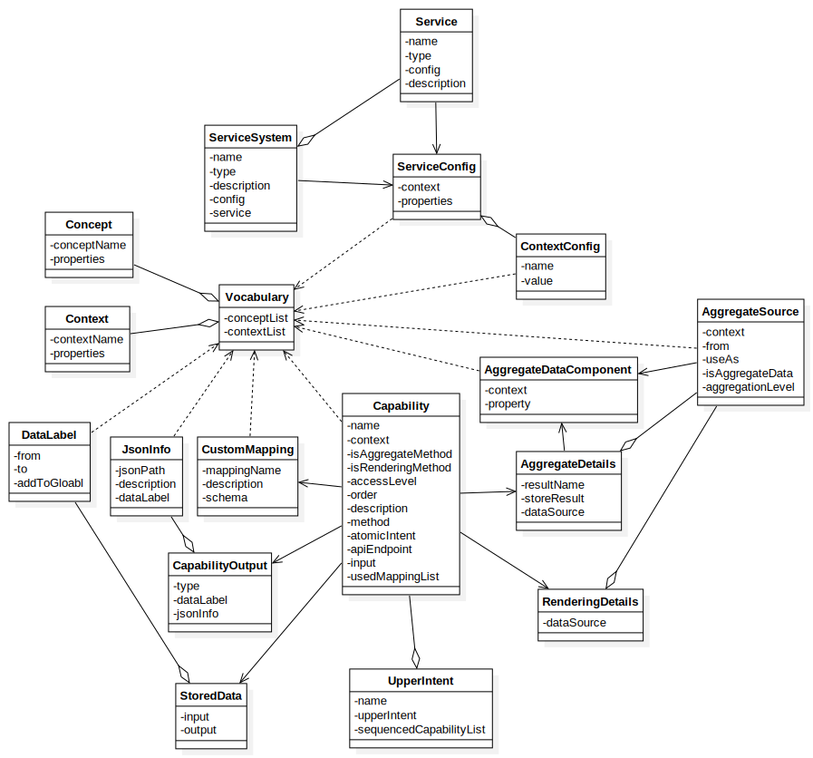

# Settings

## Concept model

> In order to let users alter existing capabilities, expand any tools or functions they need, and combine and disassemble previous functions, we extracted the attributes that might be used in function operation or information exchange, and designed a concept model



## Configuration file settings

### Vocabulary

```yml
ConceptList:
  - conceptName: conceptX
    properties:
      - propertyA
      - propertyB
ContextList:
  - contextName: tool
    properties:
      - conceptX.propertyA
      - Api.serviceName
```

### Capability

There are three types of capabilities:

- [general](#general_capability)
- [aggregate](#aggregate_capability)
- [rendering](#rendering_capability)

#### General Capability<span id="general_capability"></span>

```yml
- name: <capability-name>
  context: general
  isAggregateMethod: false
  accessLevel: <system/service>
  description: <capability-description>
  method: <GET/POST>
  atomicIntent: <atomic-intent>
  apiEndpoint: <endpoint>
  input:
    - <used-property>
  output:
    type: <plainText/json>
    dataLabel: <plainText-dataLabel>
    jsonInfo:
      - jsonPath: <data-path>
        description: <data-description>
        dataLabel: <data-label>
  usedMappingList:
    - mappingName: <mapping-name>
      description: <mapping-description>
      schema: <mapping-schema>
  storedData:
    input:
      - from: <data-source>
        to: <data-destination>
        addToGlobal: <true/false>
    output:
      - from: <daat-source>
        to: <data-destination>
        addToGlobal: <true/false>
```

#### Aggregate Capaility<span id="aggregate_capability"></span>

```yml
# aggregate capability config example
- name: <capability-name>
  context: general
  isAggregateMethod: true
  # use accessLevel to define what service is used in this capability
  # example: analyze something about service x -> service level
  # example: analyze something about system z -> system level
  accessLevel: <system/service>
  description: <capability-description>
  # method, apiEndpoint are used to define 'how to access the aggregate endpoint'
  method: POST
  # atomicIntent defines what intent used to trigger this capability, has nothing to do here since this is an aggregate capability
  atomicIntent: none
  apiEndpoint: <capability-endpoint>
  # no need to use input since aggregation capability use 'aggregateSource' to define what data should be used
  # no need to use output since aggregation result has fixed format, and it is nearly unable to predict what service might be used in the first place
  # use aggregateDetail to define what kind of data should be used and where do they come from
  input:
  output:
  aggregateDetail:
    # determine if this aggregation result needs to be stored or not
    storeResult: <true/false>
    # endpoint response result data key should use this
    # system: {[sample], [content]}
    # service: {[serviceA.sample, serviceB.sample], [contentA, contentB]}
    # used to extract data from response
    resultName: <aggregate-result-name>
    # determine what key should be used when STORING data in temporary storage
    usedComponent:
      context:
        - jenkins
        - eureka
      property:
        - User.username
    dataSource:
      - useAs: username
        isAggregationData: false
        context: jenkins
        from: User.username
      - useAs: aggregate-result-1
        isAggregationData: true
        aggregationLevel: service
        aggregateDataComponent:
          context:
            - jenkins
          property:
            - User.username
      - useAs: aggregate-result-2
        isAggregationData: true
        aggregationLevel: system
        aggregateDataComponent:
          context:
            - eureka
          property:
            - User.username
```

#### Rendering Capability<span id="rendering_capability"></span>

```yml
# rendering capability example
- name: <capability-name>
  # determine whether this capability is a rendering capability
  isRenderingMethod: true
  description: <capability-description>
  method: POST
  atomicIntent: none
  apiEndpoint: <capability-endpoint>
  # same as aggregate capability, rendering capability should be able to access all type of config, no need to use input
  input:
  # rendering capability has no customize output
  # rendering capability has no output-related definition since rendering response are expected to be a discord message template
  output:
  # rendering capability use dataSource to define what kins of data it can use
  renderingDetail:
    dataSource:
      - useAs: username
        isAggregationData: false
        context: jenkins
        from: User.username
      - useAs: aggregate-result-1
        isAggregationData: true
        aggregationLevel: service
        aggregateDataComponent:
          context:
            - jenkins
          property:
            - User.username
      - useAs: aggregate-result-2
        isAggregationData: true
        aggregationLevel: system
        aggregateDataComponent:
          context:
            - eureka
          property:
            - User.username
```

### Upper Intent

```yml
crossCapabilityList:
  # upper intent example
  - name: intent name
    upperIntent: <upper-intent>
    sequencedCapabilityList:
      - name: capability-step-1
        order: 0
        description: step 1
      - name: capability-step-2
        order: 1
        description: step 2
```

### Service

```yml
serviceList:
  - name: system-name
    type: system
    description: simple system
    config:
      - context: tool-A
        properties:
          - name: concept.propertyA
            value: property value A
    service:
      - name: microserviceX
        type: service
        description: microservice x detail
        config:
          - context: tool-B
            properties:
              - name: concept.propertyA
                value: property value B
      - name: microserviceY
        type: service
        description: microservice y detail
```
